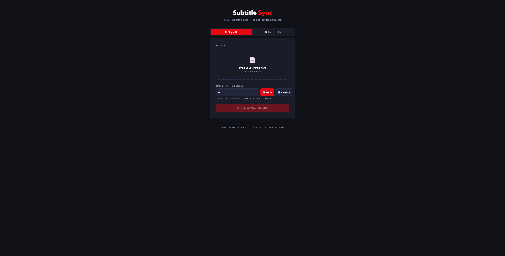
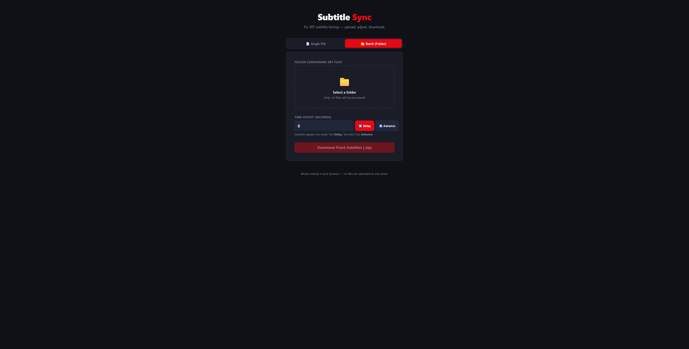

# 🎬 Subtitle Sync

> A clean, browser-based tool for fixing SRT subtitle timing — no installs, no server, no data leaves your machine.

**[🚀 Open the app](https://cr4zysh4rk.github.io/subtitle-sync)**

---

## What it does

If your subtitles are out of sync with the video — appearing too early or too late — Subtitle Sync lets you shift all timestamps by an exact offset in seconds and download the corrected file instantly.

Everything runs in your browser. Your subtitle files are never uploaded anywhere.

---

## Screenshots

### Single File Mode


### Batch Mode — Process a whole folder at once


---

## Features

| | |
|---|---|
| 📄 **Single file** | Upload one `.srt`, apply an offset, download the fixed file with its original name |
| 📁 **Batch folder** | Select a folder — only `.srt` files are picked up, all processed with the same offset, and bundled into a ready-to-extract `.zip` |
| ⏩ **Delay** | Subtitles firing too early? Push them forward in time |
| ⏪ **Advance** | Subtitles appearing too late? Pull them back |
| 🔢 **Sub-second precision** | Offset supports decimals (e.g. `0.5`, `7.5`) |
| 🔒 **100% private** | No uploads, no tracking — runs entirely client-side |

---

## How to use

### Fix a single file

1. Open the app and stay on the **Single File** tab
2. Drop your `.srt` file onto the upload area (or click to browse)
3. Enter the number of seconds to shift
4. Choose **Delay** (subtitles too early) or **Advance** (subtitles too late)
5. Click **Download Fixed Subtitle** — the file downloads with its original name

### Fix a whole season at once

1. Switch to the **Batch (Folder)** tab
2. Click the upload area and select the folder containing your `.srt` files
3. The app automatically filters to only `.srt` files and lists them
4. Set your offset and direction, then click **Download Fixed Subtitles (.zip)**
5. Extract the zip — all files keep their original names

---

## Running locally

No build step needed — it is a single HTML file.

```bash
git clone https://github.com/Cr4zySh4rk/subtitle-sync.git
cd subtitle-sync
# open index.html in any browser
open index.html
```

---

## Tech

- Vanilla HTML / CSS / JavaScript — zero dependencies for the core logic
- [JSZip](https://stuk.github.io/jszip/) (CDN) for batch ZIP generation
- Hosted on GitHub Pages

